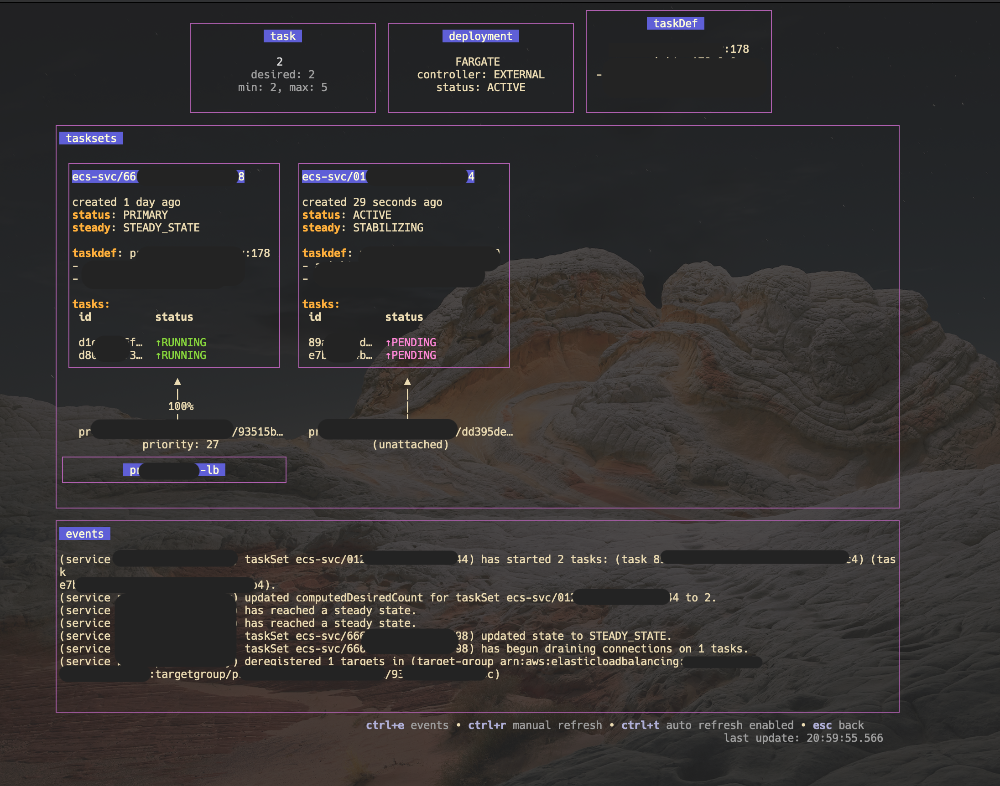

# ecstui

Opinionated ECS TUI using Bubbletea framework

## Purpose

* Condense image information, deployment configs, task sets and tasks into single service view
* Visualize load balancer to task connectivity during deployments 
* Depict a high-level overview for task sets, tasks, and general ECS information
* Provide an events view with search & highlighting
* Make everything read-only

## Assumptions

* Load balancer fetches considers only 443 port listeners
* The tool works for non-ALB connected tasks, too.


## How to run

```
go mod tidy
go run .
```

## Examples

Service overview screen:




Events search & highlights:


